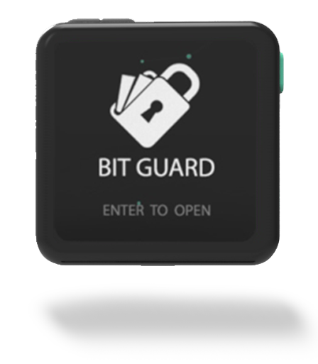

FLEX
====

Technical Specifications
------------------------

**DIMENSIONS**
	* Body Dimensions : 3.8 cm x 3.8 cm
	* Screen size : 2.8 cm x 2.8 cm

**COMMUNICATION MODULES**
	* Bluetooth 4.0 (BLE)
	* USB C-type

**COINS SUPPORTED**
	* BTC : Bitcoin
	* LTC : Litecoin
	* ETH : Ethereum
	* ERC20 : All ERC20 Tokens
	* DOGE : Dogecoin 
	* DASH : Dashcoin

**BATTERY**
	* LiPo (Lithium polymer)
	* Power : 350 mAh
	* Charging Time : 3 Hrs
	* StandBy Battery Time : 168 Hrs
	* Running Battery Time : 12 Hrs

**MICROCONTROLLER**
	* ATsamd21 : 32 bit arm cortex M0+
	* ATSHA204A : For random number generation and secure storage of mnemonics

**DISPLAY**
	* Pixels : 320 x 320
	* Type   : TFT Color 