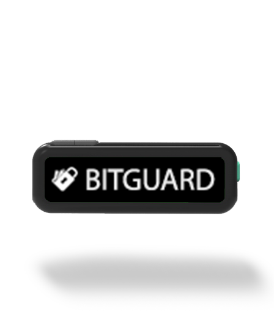

IRON
====

Technical Specifications
------------------------

**DIMENSIONS**
	* Body Dimensions : 4 cm x 1.4 cm
	* Screen size : 2.4 cm × 0.8 cm

**COMMUNICATION MODULES**
	* USB C-type

**COINS SUPPORTED**
	* BTC : Bitcoin
	* LTC : Litecoin
	* ETH : Ethereum
	* ERC20 : All ERC20 Tokens
	* DOGE : Dogecoin 
	* DASH : Dashcoin

**MICROCONTROLLER**
	* ATsamd21 : 32 bit arm cortex M0+
	* ATSHA204A : For random number generation and secure storage of mnemonics

**DISPLAY**
	* Pixels : 128 x 32
	* Type   : OLED Blue and white 